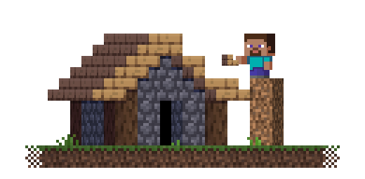

<p align="center">
<h1 align="center">MCWebGUI Builder</h1>
<p align="center"></img></p>
<p align="center"><strong>The build tool for adding new content to MCWebGUI.</strong></p>

MCWebGUI's images have to be arranged in a very specific way, and it is just painful to add new content to it. So we made this tool to easily compile readable images into their necessary formats. This will also compile a lot of other stuff in the future, such as CSS and JavaScript files. It allows for new content to be added easily using XML configuration files.

<h1 align="center">Installation</h1>

1. Download the `.exe` file, that is attached to the latest release.
2. Put it anywhere you'd like, optimally, in it's own, seperate folder.
3. Create the folders `dist` and `source` in the same folder as the `.exe`.
4. Download the `source.zip` archive from the latest release.
5. Extract the included files in the archive to the `source` folder.
6. **You're done, the setup process is complete.**

<h1 align="center">How to use</h1>
Before using MCWebGUI Builder - We  heavily recommend reading the entire README file, so you know what you're doing.

<br>

**Building Assets**
1. Run the `.exe` file in order to build the assets.
2. Navigate to the `dist` folder.
3. Transfer the built assets to MCWebGUI's assets folder *as is*.
4. Start your MCWebGUI project and see if everything is working correctly.
5. **You're done, optionally, refer to Problem solving.**

**Adding new assets**

To start off, depending on wether or not you're modifying something or adding new assets, everything is configured through XML files. Subfolders are created after the name of the XML file they originate from, meaning, if you have a file called `placeholder.xml`, a new folder called "placeholder" will be created. If it is not used, it will get deleted. Preferrably, have all files from the XML file in that folder. You need to specifiy the folder in the `<result-file>` tags, but you don't have to worry about that for now.

You'll need to have the structure set up before you can do anything, so let's start with that. Create a new `.xml` file in the `source` folder. Open it in your text editor of choice, then paste the following into that file:
```xml
example.xml

<?xml version="1.0" encoding="UTF-8"?>
<build>

</build>
```
This structure needs to be present in *every* `.xml` file, or it will be counted as invalid. Now let's talk about the build options that are available to us:

- `make-apng` - Create an animated PNG file from a spritesheet.
- `split` - Split a spritesheet into multiple files.
- `rescale` - Change the scale of an image.

Let's start off with making animated PNG files. First, we'll take a look at the file structure:
```xml
example.xml

<?xml version="1.0" encoding="UTF-8"?>
<build>

<!-- Animation Example -->
<make-apng>
    <file></file>
    <size></size>
    <frame-time></frame-time>
    <loop></loop>
    <result-file></result-file>
</make-apng>

</build>
```
Let's quickly go over the tags. `<file>`, as before, is the base file to create the animation from. `<size>` is the size of each frame, split by a comma again. `<frame-time>` is how long a frame stays. `<loop>` is the loop amount, if set to 0 it loops infinitely, if set to `none` it will not loop, aka. only play once. `<result-file>` is where the file gets put, just like before. Here's an example, with an animation included by default:
```xml
example.xml

<?xml version="1.0" encoding="UTF-8"?>
<build>

<!-- Animation Example -->
<make-apng>
    <file>animation_template.png</file>
    <size>8,8</size>
    <frame-time>64</frame-time>
    <loop>0</loop>
    <result-file>example/animation</result-file>
</make-apng>

</build>
```

---

Simple right? Just as simple as splitting images:
```xml
example.xml

<?xml version="1.0" encoding="UTF-8"?>
<build>

<!-- Split Example -->
<split>
    <file></file>
    <size></size>
    <files></files>
</split>

</build>
```
It's basically the same, `<file>` is the base, `<size>` is the part size and `<files>` are the names of the different files to be split (Split by a comma!).  Let's fill the information in:
```xml
example.xml

<?xml version="1.0" encoding="UTF-8"?>
<build>

<!-- Split Example -->
<split>
    <file>split_template.png</file>
    <size>32,32</size>
    <files>
        example/creeper,
        example/enderman,
        example/pig,
        example/sheep
    </files>
</split>

</build>
```

---

And last but not least, the simplest one of them all. `<rescale>`! This allows you to resize the image to any dimension you want.
```xml
example.xml

<?xml version="1.0" encoding="UTF-8"?>
<build>

<!-- Rescale Example -->
<rescale>
    <file></file>
    <size></size>
    <result-file></result-file>
</rescale>

</build>
```
This is pretty much self-explanatory by now. Let's fill the information in. 
```xml
example.xml

<?xml version="1.0" encoding="UTF-8"?>
<build>

<!-- Rescale Example -->
<rescale>
    <file>missing.png</file>
    <size>64,64</size>
    <result-file>example/rescale</result-file>
</rescale>

</build>
```

---

That's all the things you can build right now, more will be added in the future as we need it.

<p align="center"><strong>Need a little bit of help?</strong></p>
<p align="center"><strong><a href="https://discord.gg/KvZJGqMEhU"><br></img>Join our Discord Server</a></strong></p>

<h1 align="center">Problem solving</h1>

> **WRN** - Please create a `dist` folder before running this program.

This warning ocurrs because there is no dist folder. Please create one to solve the issue, or check if you have mispelled it.

---

> **WRN** - The `dist` folder has some files in it. Please clear it first.

The dist folder has files in it that prevent the build process from starting. You have two options:

1. You  delete the files in the `dist` folder manually
2. You can download the `clear_dist.bat` file from the latest release, to do the clearing process automatically in the future.

---

> **ERR** - The `source` folder doesn't seem to exist. Cannot continue.

This message ocurrs, because the program couldn't find a source folder to build the assets from. Check if you've mispelled the name, or if it's there in the first place.

---

> **ERR** - No `.xml` files were found in the `source` folder!

There are no `.xml` configuration files for building the assets, therefore the program cannot do anything. Check if you've got the file extension right, or if the assets from the latest release are there.

---

> **ERR** - This XML file is invalid, it cannot be processed.

Something's wrong with your `.xml` file. There could be a lot of reasons why this ocurrs, here are a few:

1. The file is empty, therefore there is nothing to be parsed.
2. You forgot the `<build>` tag, check if it's missing.
3. There's a syntax error. Check if your file structure is valid.

Are none of these the issue? Ask in [our Discord server](https://discord.gg/KvZJGqMEhU).

---

> **ERR** - There seems to be some information missing. Cannot continue.

This error can ocurr while **Making an APNG file**, **Splitting Images** or **Rescaling Images**. There can be multiple reasons why this error ocurrs.

1. Tags inside the specified action have invalid content or are missing.
2. Numbers aren't valid. Check if they're correct.
3. The image is corrupted or not the right scale.

Are none of these the issue? Ask in [our Discord server](https://discord.gg/KvZJGqMEhU).

---

<p align="center"><strong>Are none of these solutions working?</strong></p>
<p align="center"><strong><a href="https://discord.gg/KvZJGqMEhU"><br></img>Join our Discord Server</a></strong></p>
